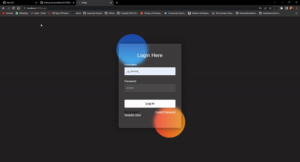
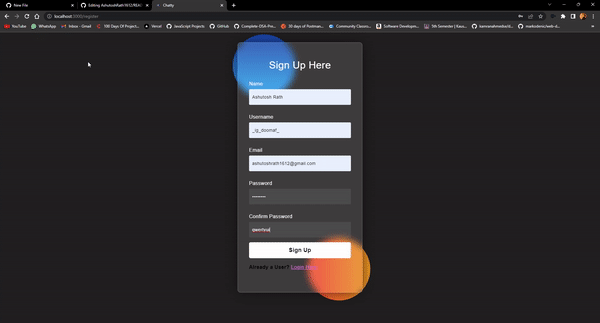
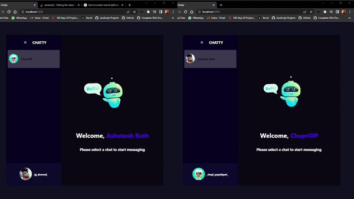

# Chat-App

<h1>This is a chat app where user can login and chat with his friends</h1>
<h1>Built With:
<br/>
<a  href="https://nodejs.org/en/">
    
  </a>
<a  href="https://nodejs.org/en/">
    
  </a>
    <a href="https://reactjs.org/">
    
  </a>
   <a  href="https://nodejs.org/en/">
    
  </a>
   <a  href="https://nodejs.org/en/">
    
  </a>
  
</h1>

<h1>How it looks: 
<br />
<br/>
<br/>

</h1>

# Some important information about MERN
## Getting Started
```
cd server
npm i
nodemon index.js
```
<p>This runs the node server on localhost:5000</p>
Open a new terminal and run the following command:

```
cd clients
npm i
npm start
```
Open [http://localhost:3000](http://localhost:3000) with your browser to see the result.

## Learn More

To learn more about Reactjs, take a look at the following resources:

- [React Documentation](https://reactjs.org/docs/getting-started.html) - learn about React features and API.
- [Learn React](https://reactjs.org/tutorial/tutorial.html) - an interactive React tutorial.

You can check out [the React GitHub repository](https://github.com/facebook/react/) - your feedback and contributions are welcome!


# Thanks for visiting🤗
